# MCP Research

**Your AI asks the questions, and the answers stop disappearing into a chat log.**

MCP Research is a self-hosted research workspace that an AI assistant drives
through the [Model Context Protocol](https://modelcontextprotocol.io). The
assistant designs the structure of a topic, interviews you, writes up what it
learns as cross-referenced entries, tracks its own todo list, draws roadmaps —
and every bit of it lands in a web UI you can browse, share and export, backed by
a single SQLite file you own.

One Go binary. No account, no cloud, no vendor. Download it, point Claude, Cursor
or ChatGPT at it, and start.

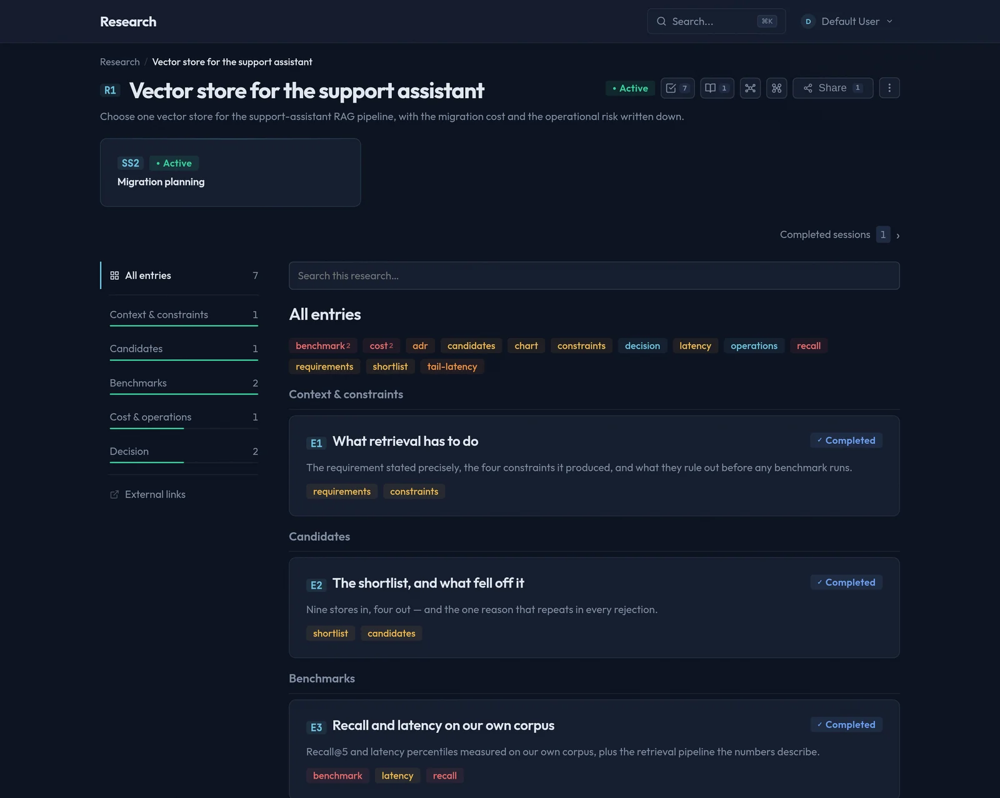

---

## Table of contents

- [The problem](#the-problem)
- [What you get](#what-you-get)
- [How a research actually runs](#how-a-research-actually-runs)
- [Install](#install)
- [Connect your AI](#connect-your-ai)
- [Documentation for the AI: llms.txt](#documentation-for-the-ai-llmstxt)
- [Teams, roles and share links](#teams-roles-and-share-links)
- [Configuration](#configuration)
- [MCP tools](#mcp-tools)
- [Deployment](#deployment)
- [Building from source](#building-from-source)

---

## The problem

You spend an hour with an AI working out which vector store to use, how payments
flow through your company, or what actually broke last Tuesday. It is a good
hour. Then the conversation scrolls away.

Next week you ask the same assistant the same question and it has no idea what
you decided, or why. The reasoning was never written down anywhere a person — or
the next session — could find it.

**MCP Research gives the conversation somewhere to land.** The assistant is no
longer producing chat messages; it is producing a structured document with
sections, entries, sources, open questions and decisions, kept in a database, in
front of you, updating live while it works.

What that changes in practice:

| Without it | With it |
|---|---|
| Findings live in scrollback | Findings live in sections and entries with short codes (`E3`, `R2:E5`) |
| Every session starts from zero | Working instructions and memory persist per research |
| "Didn't we decide this already?" | Decision entries, revision history, and who wrote what |
| Copy-paste into Notion afterwards | Markdown, PDF, an Obsidian vault, or portable JSON on demand |
| The AI's plan is invisible | A task board and roadmaps the AI maintains itself |

---

## What you get

### An AI-run interview, recorded

Sessions are the interview loop. The assistant proposes the questions, you
answer, and it keeps asking until the section is actually covered — questions can
be answered, deferred or skipped, follow-ups branch off the ones that need it,
and progress is visible the whole way. A research can hold as many sessions as
the topic needs: scoping, deep dive, follow-up three weeks later.

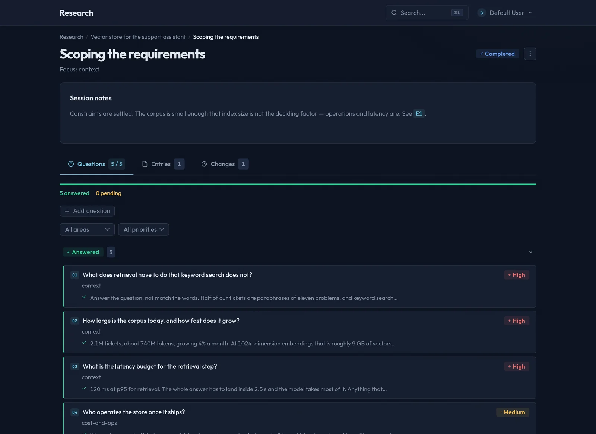

### Entries that are documents, not notes

Every finding is an entry inside a section, written in markdown — tables, code,
quotes, and **Mermaid diagrams rendered as interactive SVG** (pan, zoom,
fullscreen, reopen in mermaid.live).

Cross-references use a wiki syntax the assistant is taught to write: `[[E3]]`
links to another entry, `[[R2:E5]]` reaches into another research, `[[RM1]]`
points at a roadmap. They render as real links everywhere — entries, answers,
task results, session notes — and they build a graph you can query.

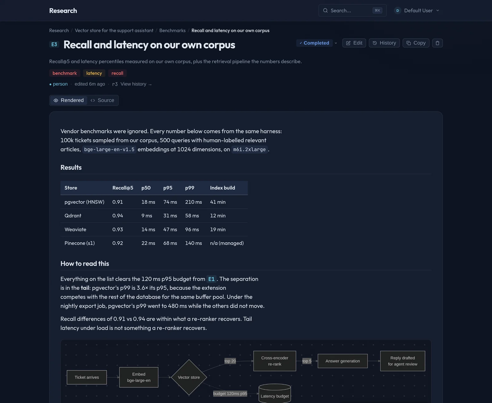

### Block documents and HTML artifacts

When prose is the wrong shape, an entry can be a **block document** instead:
typed blocks — paragraphs, callouts, tables, checklists, Mermaid, code — that an
agent can patch one block at a time without rewriting the page. A checklist keeps
the boxes a human ticked even when the agent rewrites the text around them.

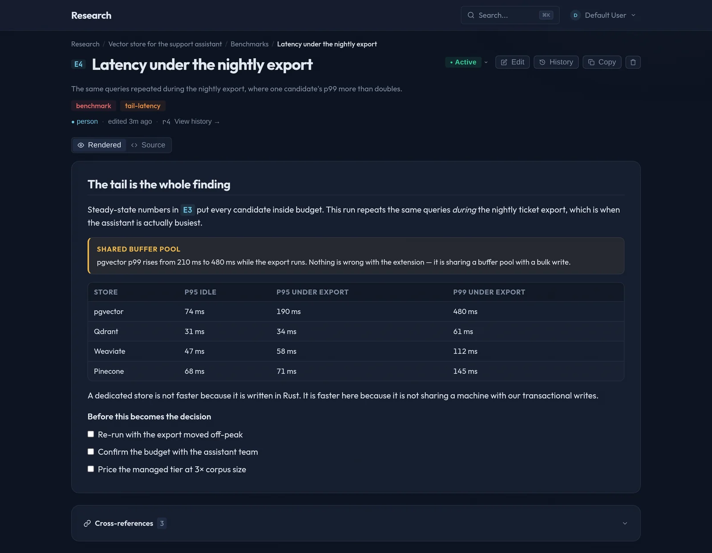

And when the finding *is* a picture, the assistant writes an **artifact**: a
self-contained HTML document rendered in a sandboxed iframe — a chart, a
comparison grid, a small interactive view — sized to its content and printable
with the rest of the research.

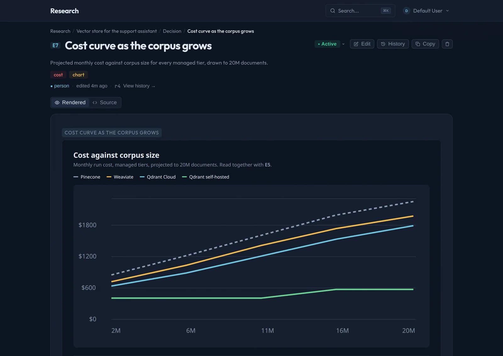

### A todo list the AI keeps for itself

Tasks are how the assistant tracks its own work: what it has verified, what is in
flight, what is still open. Statuses, priorities, and a result written back when
a task closes.

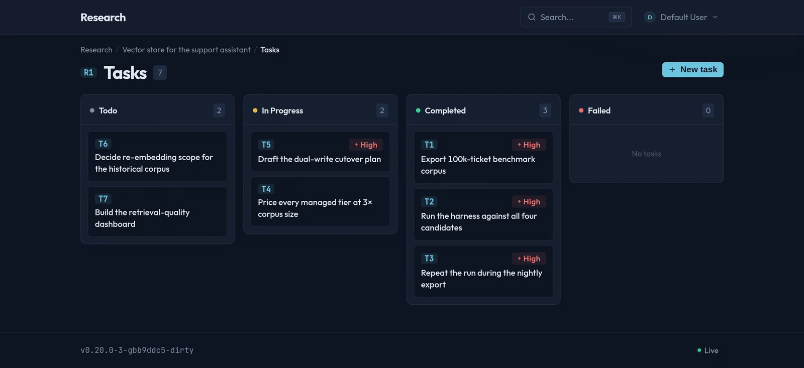

### Roadmaps: deliberate graphs

A roadmap is a directed graph you design on purpose — a migration plan, a
learning path, a decision tree with branches that actually branch. Nodes carry
their own statuses, can reference an entry or a task, and show its live state.

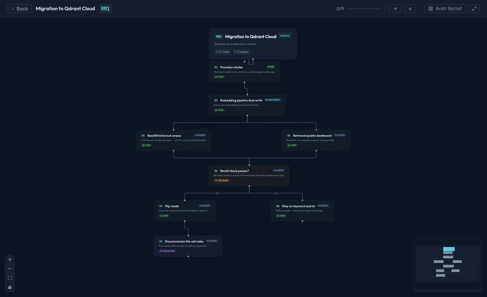

### The whole research as one map

The mindmap is generated, not drawn: every section, entry, session, question and
task in one canvas, collapsible, with cross-reference edges. There is also a
knowledge-graph view filtered by node and edge type when you want to see the
links rather than the hierarchy.

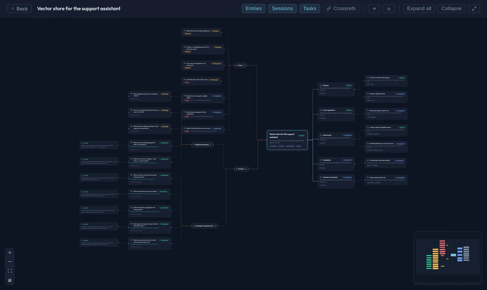

### Export that produces a document, not a dump

One page renders the entire research — table of contents, every section and
entry, every session with its answers, every task with its result — ready to
**print to PDF**, **download as markdown**, or **download as an Obsidian vault**
(a zip of folders and linked notes, `[[E3]]` intact). Portable JSON moves a whole
research to another server, and imports back.

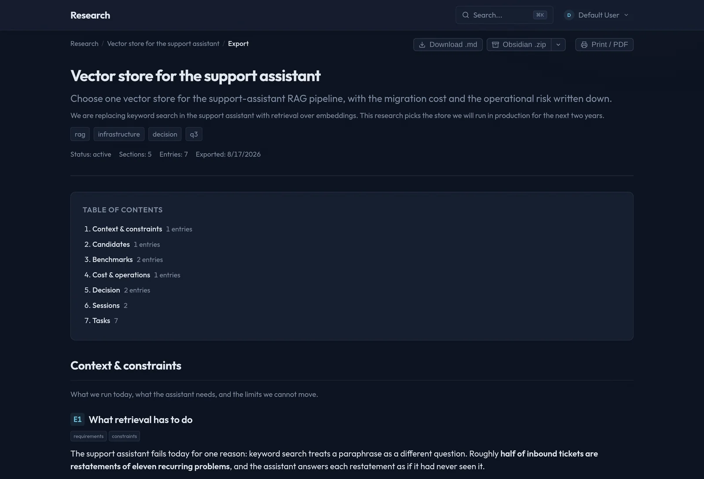

### Everything else that makes it a product

- **Revision history on every entry** — who wrote it (agent, human, import,
  restore), during which session, what changed, and a diff. Restore any revision.
  A session page can show everything that session changed.
- **Live updates over WebSocket** — the UI moves while the AI works, in every
  transport mode, because it all runs in one process.
- **Search** across researches, and inside one research.
- **Read-only share links** for people without an account.
- **Teams and roles** when more than one person is involved.
- **Multiple researches**, tagged, filtered, with global short codes (`R1`, `R2`).

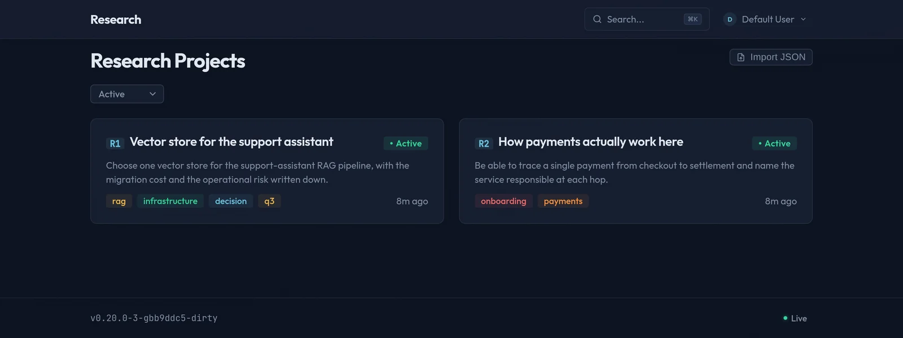

---

## How a research actually runs

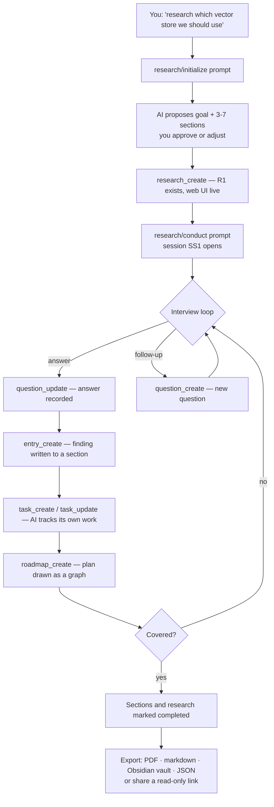

In a client, it is about this short:

```
You:  Use the research/initialize prompt. Topic: which vector store for our
      support assistant.

AI:   [asks about corpus size, latency budget, who operates it]
      [proposes: Context & constraints, Candidates, Benchmarks, Cost & operations, Decision]
      Created R1. Open http://localhost:8088/research/R1

You:  Good. Conduct it.

AI:   [opens session SS1, asks 5 questions, records your answers]
      [writes E1 What retrieval has to do, E2 The shortlist...]
      [opens tasks: run the benchmark harness, price the managed tiers]
      Section "Context & constraints" is complete. Ready for the benchmark section?
```

Everything the assistant writes appears in the browser as it happens. You are
reading a document being built, not waiting for a summary at the end.

---

## Install

### Download a binary

Single static binary, no dependencies, no CGo.

```bash
# macOS (Apple Silicon)
curl -L -o mcp-research \
  https://github.com/butschster/mcp-research/releases/latest/download/mcp-research-darwin-arm64
chmod +x mcp-research

# macOS (Intel)
curl -L -o mcp-research \
  https://github.com/butschster/mcp-research/releases/latest/download/mcp-research-darwin-amd64
chmod +x mcp-research

# Linux (x86_64)
curl -L -o mcp-research \
  https://github.com/butschster/mcp-research/releases/latest/download/mcp-research-linux-amd64
chmod +x mcp-research

# Linux (ARM64)
curl -L -o mcp-research \
  https://github.com/butschster/mcp-research/releases/latest/download/mcp-research-linux-arm64
chmod +x mcp-research

# Windows (PowerShell)
Invoke-WebRequest -Uri https://github.com/butschster/mcp-research/releases/latest/download/mcp-research-windows-amd64.exe -OutFile mcp-research.exe
```

Run it with a database file:

```bash
./mcp-research --db research.db
```

That is the whole setup. You now have:

| | |
|---|---|
| Web UI | [http://localhost:8088](http://localhost:8088) |
| REST API | same port, `/api/...` |
| AI documentation | [http://localhost:8088/llms.txt](http://localhost:8088/llms.txt) |
| OpenAPI spec | [http://localhost:8088/api/openapi.yaml](http://localhost:8088/api/openapi.yaml) |
| MCP over stdio | ready for local clients |

Without `--db` everything runs in memory and disappears on exit — fine for a
first look, not for real work.

### Docker

Published image, tagged per release:

```bash
docker run -d --name mcp-research \
  -p 8088:8088 -p 8081:8081 \
  -v mcp-data:/data \
  -e MCP_RESEARCH_DB=/data/research.db \
  -e MCP_RESEARCH_TRANSPORT=sse \
  ghcr.io/butschster/mcp-research:latest
```

Or with compose and a config file:

```bash
git clone https://github.com/butschster/mcp-research.git
cd mcp-research
cp config.yaml.example config.yaml     # set base_url, jwt_secret, auth_enabled
docker compose up -d
```

`docker-compose.yaml` builds from source by default; swap `build: .` for
`image: ghcr.io/butschster/mcp-research:latest` to pull the published image
instead.

---

## Connect your AI

Three ways in, depending on what your client supports. All of them talk to the
same process and the same database.

### 1. Local MCP client over stdio

Claude Code, Claude Desktop and Cursor spawn the binary themselves. The assistant
gets **36 tools** and **2 research prompts**.

**Claude Code** — `~/.claude/mcp.json`:

```json
{
  "mcpServers": {
    "mcp-research": {
      "command": "/path/to/mcp-research",
      "args": ["--db", "/path/to/research.db"]
    }
  }
}
```

**Claude Desktop** — `~/.claude/claude_desktop_config.json`, and **Cursor** —
`~/.cursor/mcp.json`, take the same block.

For a local setup with auth on, `--default-user` creates the user if missing and
auto-logs the web UI in, so there is no login page in your own workflow:

```json
{
  "mcpServers": {
    "mcp-research": {
      "command": "/path/to/mcp-research",
      "args": ["--db", "/path/to/research.db",
               "--auth-enabled", "--default-user", "you@local.dev"]
    }
  }
}
```

Then ask for the `research/initialize` prompt to start.

### 2. Remote MCP — ChatGPT, Claude.ai

Deploy the server with auth enabled and a public base URL. External clients set
themselves up over OAuth2 — Dynamic Client Registration (RFC 7591) and PKCE
(RFC 7636) — so there is nothing to configure by hand beyond the URL.

```bash
./mcp-research --transport sse --db research.db \
  --auth-enabled --base-url "https://mcp.example.com"
```

- **ChatGPT** — MCP server URL: `https://mcp.example.com/sse`
- **Claude.ai** — integration URL: `https://mcp.example.com`

What happens on first connect:

1. Client hits the endpoint, gets `401` with a `WWW-Authenticate` header
2. Reads `/.well-known/oauth-protected-resource` → finds the authorization server
3. Reads `/.well-known/oauth-authorization-server` → finds the endpoints
4. Registers itself via `POST /auth/register` (DCR)
5. You log in on an HTML page and authorize it
6. It exchanges the code with PKCE for an access token
7. It connects to MCP with that token — full toolset

Two remote transports run at once: **Streamable HTTP** at `/mcp` and `/` (ChatGPT,
Claude.ai) and **SSE** at `:8081/sse` for legacy clients. Browser traffic to `/`
still gets the web UI — MCP requests are detected and routed.

### 3. No MCP at all — llms.txt plus the REST API

Any assistant that can read a URL and make HTTP calls can use the product without
MCP. See below.

---

## Documentation for the AI: llms.txt

The server documents itself, for models rather than for people, at
[`/llms.txt`](http://localhost:8088/llms.txt) — the
[llms.txt convention](https://llmstxt.org/). It is not a marketing page: it is
the data model, the short-code and cross-reference syntax, the entry types, the
access rules, and an index of deeper guides that are served as plain markdown at
`/llms/<name>.md`:

| Document | What it covers |
|---|---|
| `/llms.txt` | Entry point — data model, short codes, `[[refs]]`, entry types, index |
| `/llms/mcp-client-guide.md` | All 36 tools, the input-schema contract, nullable fields, common pitfalls |
| `/llms/domain-guide.md` | Every entity in full: fields, statuses, lifecycle, the role matrix, the real-time event stream |
| `/llms/conducting-research.md` | The workflow itself — initialize, interview, write entries, complete |
| `/llms/tasks.md` | When to open a task, statuses, tasks vs questions |
| `/llms/roadmaps.md` | Node and edge types, custom statuses, building a graph step by step |
| `/llms/blocks.md` | The block document format and all block types |
| `/llms/artifacts.md` | Writing the HTML that goes inside an artifact, and the sandbox rules |
| `/llms/revisions.md` | History, diffs, restore, and what does not create a revision |
| `/llms/export.md` | Every export form and endpoint |
| `/api/openapi.yaml` | OpenAPI 3.1 spec for the REST API |

Point any assistant at `https://your-server/llms.txt` and it can drive the whole
product over REST. MCP clients get the same guides — they are what the tool
descriptions link to when a model needs more than a one-line schema.

To let a non-MCP client write, give it a token:

```bash
./mcp-research --db research.db --api-token my-secret-token
```

Read endpoints stay open (unless `auth_enabled`); writes require
`Authorization: Bearer my-secret-token`.

The same token is what identifies **you, the operator** — as distinct from any
user or team on the instance. It unlocks one thing no account can do: adding a
**kickoff methodology that every team on this server sees**.

```bash
curl -X POST https://your-server/api/templates \
  -H "Authorization: Bearer my-secret-token" \
  -H 'Content-Type: application/json' \
  -d '{
    "name": "House diligence",
    "when_to_use": "Use when a supplier or partnership is assessed here and the answer goes to the committee.",
    "when_not_to_use": "Not for a technical evaluation.",
    "body": "## Before you propose anything\n\nAsk who signs it off. ...",
    "skills": ["evidence-grading"]
  }'
```

A methodology is what an AI reads *before* it starts a research: what to ask you
first, what structure to propose, when the work is finished. Eleven ship with the
app; this adds yours next to them. It survives every upgrade — what ships is
refreshed from the binary, what you write here is not touched.

A team can write its own too, at `POST /api/teams/{id}/templates`, and that one
stays private to the team. Only the `api_token` reaches the server-wide list, and
without an `api_token` configured, nothing does. Everybody can browse the result
at `/templates` in the web UI. Full reference: `/llms/templates.md` on your own
server.

---

## Teams, roles and share links

Auth is **off by default** — a single user on a laptop never meets any of this.
Turn it on for anything shared:

```yaml
# config.yaml
auth_enabled: true
jwt_secret: "a-long-random-string"
allow_registration: true
base_url: "https://mcp.example.com"
```

**Teams own researches; your role in the team is what grants access.** Everyone
gets a personal team on registration, so the concept stays invisible until you
actually collaborate.

| Role | Can |
|---|---|
| `viewer` | read and export |
| `editor` | + create and edit content |
| `owner` | + manage members, move researches between teams |

Members join by invite link. A non-member is told the research does not exist
rather than that it is forbidden — confirming a research exists is itself
information.

**Share links** hand a research to someone with no account at all: a revocable
token, optionally password-protected and time-limited, that opens a read-only
copy at `/s/{token}`. You choose what the link includes — sessions, tasks,
roadmaps, export. Working process is never shared: instructions, memory, entry
provenance and revision history stay behind the login.

Other auth features:

- **API keys** for long-lived programmatic access, created in Settings
- **OAuth2** with PKCE + DCR for external MCP clients
- The first registered user adopts any pre-existing researches from an
  unauthenticated database

---

## Configuration

Priority: **CLI flags > env vars > `config.yaml` > defaults.**

| Setting | CLI flag | Env var | Default |
|---|---|---|---|
| Transport | `--transport` | `MCP_RESEARCH_TRANSPORT` | `stdio` |
| MCP port (SSE) | `--mcp-port` | — | `8081` |
| Web port | `--web-port` | — | `8088` |
| Database path | `--db` | `MCP_RESEARCH_DB` | in-memory |
| Log level | `--log-level` | `MCP_RESEARCH_LOG_LEVEL` | `info` |
| Write API token | `--api-token` | `MCP_RESEARCH_API_TOKEN` | write API disabled |
| ↳ also the **operator** credential — the only way to add a server-wide methodology | | | |
| Auth | `--auth-enabled` | `MCP_RESEARCH_AUTH_ENABLED` | `false` |
| JWT secret | `--jwt-secret` | `MCP_RESEARCH_JWT_SECRET` | auto-generated |
| Registration | `--allow-registration` | `MCP_RESEARCH_ALLOW_REGISTRATION` | `true` |
| Public base URL | `--base-url` | `MCP_RESEARCH_BASE_URL` | — |
| Default user | `--default-user` | `MCP_RESEARCH_DEFAULT_USER` | — |
| Config file | `--config` | `MCP_RESEARCH_CONFIG` | `./config.yaml` |

Data model, in short:

```
Team — owns researches; a role in it is the whole access model
  Research (R1, R2...)
    ├── Section (S1, S2...) → Entry (E1, E2...) → Revision (1, 2, 3...)
    ├── Session (SS1, SS2...) → Question (Q1, Q2...)
    ├── Task (T1, T2...)
    ├── Roadmap (RM1, RM2...) → Node (N1, N2...) + edges
    └── Share — a revocable read-only link
```

Short codes are assigned automatically and accepted wherever an id is:
`/api/researches/R1/sessions/SS1/export` resolves like the UUIDs do.

---

## MCP tools

36 tools, 2 prompts.

| Category | Tools |
|---|---|
| **Research** | `research_create`, `research_get`, `research_list`, `research_update`, `research_add_section` |
| **Sections** | `section_list`, `section_update` |
| **Entries** | `entry_create`, `entry_read`, `entry_list`, `entry_update`, `entry_patch`, `entry_delete`, `entry_history`, `entry_diff` |
| **Sessions** | `session_create`, `session_get`, `session_update` |
| **Questions** | `question_create`, `question_update`, `question_list` |
| **Tasks** | `task_create`, `task_update`, `task_list`, `task_delete` |
| **Roadmaps** | `roadmap_create`, `roadmap_get`, `roadmap_list`, `roadmap_update`, `roadmap_delete`, `roadmap_add_nodes`, `roadmap_update_node`, `roadmap_remove_nodes` |
| **Teams** | `team_list` |
| **Transfer** | `research_export`, `research_import` |

**Prompts:** `research/initialize` (design a new research with you) and
`research/conduct` (run the interview and write it up).

Share links have no tool on purpose: creating or revoking one is a human act, done
in the web UI or over REST.

---

## Deployment

### Docker Compose

```bash
cp config.yaml.example config.yaml   # set base_url, jwt_secret, auth_enabled
docker compose up -d
```

Ports: `8088` (web UI, REST, MCP Streamable HTTP, WebSocket, OAuth) and `8081`
(MCP SSE). The SQLite database lives in the `mcp-data` volume — that file is your
entire installation, so back it up like one.

### Behind nginx

A template lives in `deploy/nginx/mcp-research.conf`:

```bash
export SERVER_NAME=mcp.example.com
envsubst '${SERVER_NAME}' < deploy/nginx/mcp-research.conf \
  > /etc/nginx/sites-enabled/mcp-research.conf
nginx -t && systemctl reload nginx
certbot --nginx -d mcp.example.com
```

It proxies `/` to `:8088` (including the WebSocket upgrade) and `/sse`,
`/message` to `:8081`. Set `base_url` to the public HTTPS URL — the OAuth
metadata documents are generated from it.

---

## Building from source

Requires Go 1.25+ and Node.js 22 with npm 11 (the repository ships no lockfile,
and npm 10 fails to resolve the frontend tree — `npm install -g npm@11` first).

```bash
git clone https://github.com/butschster/mcp-research.git
cd mcp-research

make build-all     # build the Nuxt frontend, embed it, compile the binary
make run           # run against research.db
make run-sse       # SSE on :8081, REST + WebSocket on :8088
make test          # go test ./cmd/... ./internal/...
make frontend-dev  # Nuxt dev server on :3000, proxying the API to :8088
```

Architecture: one Go process serving MCP (stdio + Streamable HTTP + SSE), a REST
API, a WebSocket hub, OAuth2 endpoints, and the embedded Nuxt 4 SPA — over SQLite
through a pure-Go driver. `CLAUDE.md` documents the layering for contributors.

---

## License

MIT
