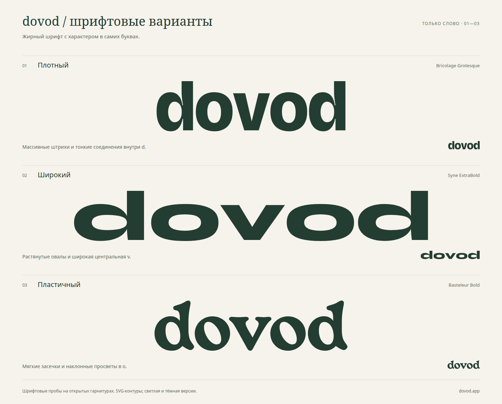

# Dovod — жирное шрифтовое написание

Откройте [index.html](index.html): три варианта, переключение фона, образцы для шапки сайта и скачивание SVG. Страница работает локально без сетевых запросов; ссылки на шрифты открывают сайты авторов.

## Варианты

1. **01-ink / Плотный** — Bricolage Grotesque, вес 800, ширина 100, оптический размер 96. Массивные буквы с тонкими соединениями в d. Трекинг −18 единиц шрифта.
2. **02-wide / Широкий** — Syne ExtraBold, вес 800. Очень широкие овалы и раскрытая v. Трекинг −15 единиц шрифта.
3. **03-organic / Пластичный** — Basteleur Bold. Мягкие засечки, наклонные просветы и литературный характер. Трекинг −13 единиц шрифта.

В трёх исходных шрифтовых пробах формы букв взяты из указанных гарнитур, настроены интервалы, выполнен экспорт в контуры. Формы букв в исходных пробах не модифицированы. Следующий этап после выбора — при необходимости индивидуальная доработка букв и интервалов.

## Выбранное направление

Выбран **01-ink / Плотный**. Обе буквы d сохраняют обычное направление. Зеркалирование последней d отклонено: она превращается в b. Дальнейшая работа ведётся с исходным плотным написанием.

## Горизонтальный разрез

[cut.html](cut.html) — исходное плотное написание и две пробы с прозрачной горизонтальной полосой:

- `01-ink-cut.svg` — полоса 2,5% высоты букв.
- `01-ink-cut-wide.svg` — полоса 5% высоты букв.
- Суффикс `-inverse` обозначает светлую версию.
- `cut-overview.svg` / `cut-overview.png` — лист сравнения.

Центр полосы находится на 60% высоты от верха букв, в средней части округлых строчных. Разрез выполнен векторным `clipPath`: через него виден любой фон. Буквы и интервалы исходного плотного написания сохранены. В HTML также есть образцы высотой 24 и 32 px для проверки читаемости.

## Разрез шире

[cut-wider.html](cut-wider.html) — предыдущие 5% рядом с разрезами 8% и 12% высоты букв. Центр полосы остаётся на 60% высоты от верха.

- `01-ink-cut-08.svg` и `01-ink-cut-12.svg` — новые варианты.
- Суффикс `-inverse` — светлая версия.
- `cut-wider-overview.svg` / `cut-wider-overview.png` — лист сравнения.

## Файлы

- `01-ink.svg`, `02-wide.svg`, `03-organic.svg` — тёмные буквы на прозрачном фоне.
- Файлы с суффиксом `-inverse` — светлые буквы на прозрачном фоне.
- `overview.svg` и `overview.png` — лист сравнения. На листе все три написания показаны с одинаковой высотой букв; у широкого варианта длина закономерно больше.
- `references.md` — изученные примеры и источники.
- `recipe.json` — параметры экспорта, исходные файлы и SHA-256.
- `licenses/` — лицензии исходных шрифтов SIL OFL 1.1.

Логотипы содержат только векторные контуры: установка шрифтов не нужна. Для изменения цвета замените корневой `fill`. Цвета — `#243D32` и `#F6F3EC`; палитра используется для сравнения и ещё не утверждена. SVG имеют минимальные поля; свободное пространство задавайте при размещении.

Текст подписей в `overview.svg` использует Noto Sans и Noto Serif с запасными системными шрифтами. Логотипы на самом листе также переведены в контуры.

## Авторы шрифтов

- [Bricolage Grotesque](https://github.com/ateliertriay/bricolage) — Mathieu Triay / The Bricolage Grotesque Project Authors.
- [Syne](https://gitlab.com/bonjour-monde/fonderie/syne-typeface) — Bonjour Monde, Lucas Descroix, Arman Mohtadji / The Syne Project Authors.
- [Basteleur](https://velvetyne.fr/fonts/basteleur/) — Keussel, Velvetyne.
